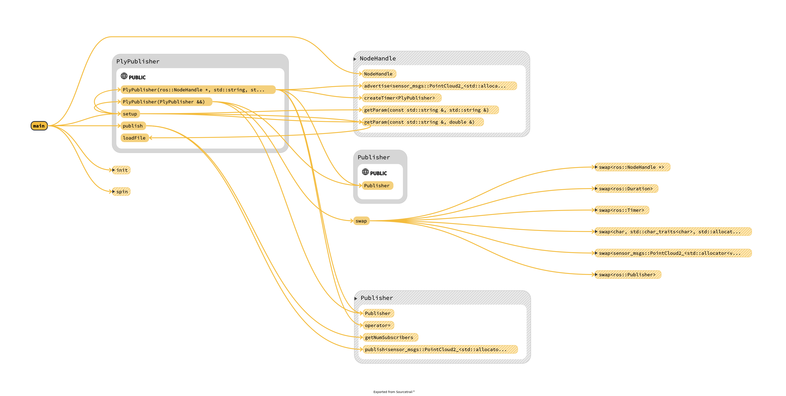
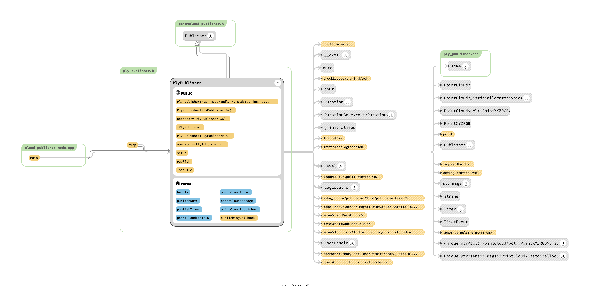
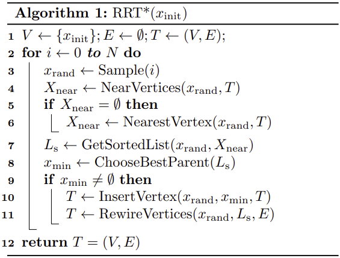
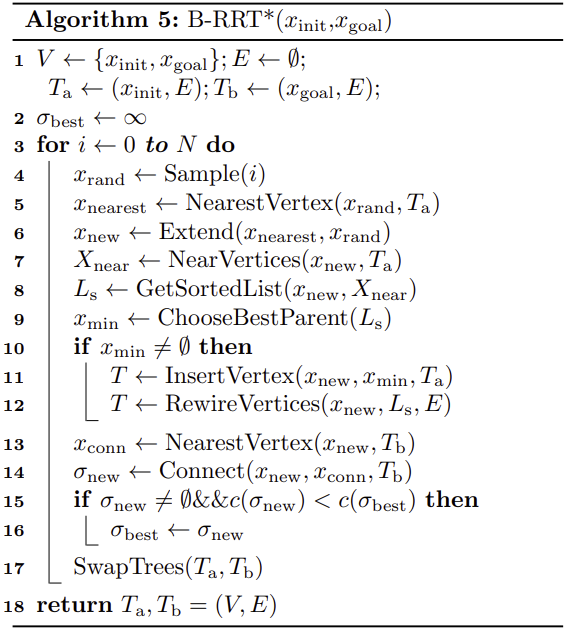
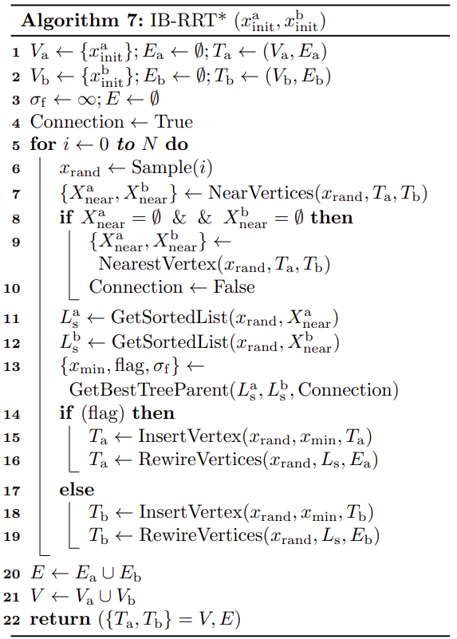
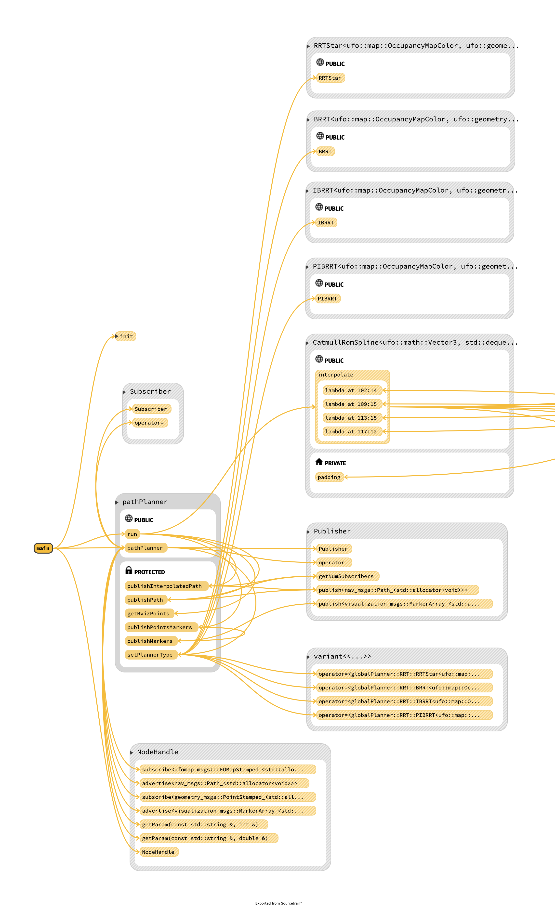
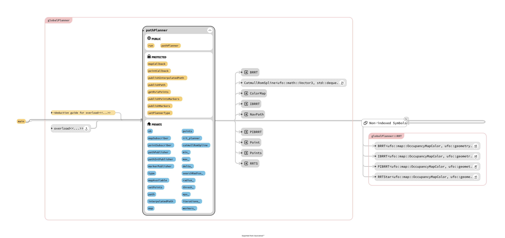

<div id="top"></div>

Udacity C++ Nanodegree Final Project
---
---


<!-- PROJECT SHIELDS -->
<!--
*** I'm using markdown "reference style" links for readability.
*** Reference links are enclosed in brackets [ ] instead of parentheses ( ).
*** See the bottom of this document for the declaration of the reference variables
*** for contributors-url, forks-url, etc. This is an optional, concise syntax you may use.
*** https://www.markdownguide.org/basic-syntax/#reference-style-links
-->
[![Forks][forks-shield]][forks-url]
[![Stargazers][stars-shield]][stars-url]
[![Issues][issues-shield]][issues-url]
[![MIT License][license-shield]][license-url]
[![LinkedIn][linkedin-shield]][linkedin-url]

<!-- PROJECT LOGO -->
<br />
<div align="center">
  <a href="https://github.com/alsarmie/3D-MAV-Path-Planner">
    
  </a>

<h3 align="center">3D Path Planner for Micro Aerial Vehicles in Cluttered Environments</h3>

  <p align="center">
Based on
<a href="https://arxiv.org/pdf/1703.08944.pdf">Intelligent bidirectional rapidly-exploring random trees for optimal
motion planning in complex cluttered environments</a>
    <br />
    <a href="https://github.com/alsarmie/3D-MAV-Path-Planner/issues">Report Bug</a>
    ·
    <a href="https://github.com/alsarmie/3D-MAV-Path-Planner/issues">Request Feature</a>
  </p>
</div>


<!-- TABLE OF CONTENTS -->
<details>
  <summary>Table of Contents</summary>
  <ol>
    <li>
      <a href="#about-the-project">About The Project</a>
      <ul>
        <li><a href="#map-generation-and-point-cloud-publisher">Map generation and point cloud publisher</a></li>
      </ul>
      <ul>
        <li><a href="#path-planning-algorithms">Path planning algorithms</a></li>
      </ul>
    </li>
    <li><a href="#rubric">Rubric</a></li>
    <li>
      <a href="#getting-started">Getting Started</a>
      <ul>
        <li><a href="#prerequisites-and-dependencies">Prerequisites and Dependencies</a></li>
        <li><a href="#installation">Installation</a></li>
      </ul>
    </li>
    <li><a href="#usage">Usage</a></li>
    <li><a href="#roadmap">Roadmap</a></li>
    <li><a href="#contributing">Contributing</a></li>
    <li><a href="#license">License</a></li>
    <li><a href="#contact">Contact</a></li>
    <li><a href="#acknowledgments">Acknowledgments</a></li>
  </ol>
</details>


<!-- ABOUT THE PROJECT -->

## About The Project

![Product Name Screen Shot][product-screenshot]

The following repo contains the code for the final project of the Udacity C++ Nanodegree Programme developed in ROS
Noetic with C++17.

The topic of interest on which the project builds on is path planning, which is a well-known problem in robotics. The
issue can be defined as the process of finding a collision-free path for a robot from its initial to goal point while
avoiding collisions with any static obstacles or other agents or obstacles present in its environment. Although path
planning is not the only fundamental issue of robotics, it has gained popularity among researchers due to the plethora
of applications in autonomous vehicles and robots, manufacturing, surgery, video games and many other aspects of modern
life.

From the diverse amount of path planning methods available in literature. a popular sampling based motion planning
algorithm known as RRT (Rapidly-exploring Random Trees) was selected due to its computational efficiency and its
effectiveness. Four variants of the base RRT motion planning algorithm were implemented in this project
to allow the application of all concepts learnt in the C++ Nanodegree programme.

The goal of the project is to develop an `efficient 3D path planner that could work with volumetric map representation
frameworks such as VoxBlox or UFOMap` and be used in Micro Aerial
Vehicles. [`UFOMap`](https://github.com/UnknownFreeOccupied/ufomap) was the map representation
framework
selected due to its efficiency and ease of integration with modern C++.

The project is divided into two main ROS packages:

* `pointcloud_publisher`
* `path_planner`

The [`ufomap`](https://github.com/UnknownFreeOccupied/ufomap) ROS package is used as is, provided by the original
author/repo.

<p align="right">(<a href="#top">back to top</a>)</p>

<!-- MAP GENERATION -->

### Map generation and point cloud publisher.

The `pointcloud_publisher` package has two main goals:

1. Generate map representations via RTAB-Map ROS. This requires certain dependencies, such as Python, OpenCV + Contrib
   modules and having Intel's D435i+T265 cameras. To generate a map from a real environment,
   the `3d_mapping_d435i.launch` can be used. The end product of this process is a map that can be saved into a `*.ply`
   file containing the point cloud data of the mapped environment.

> ***The map generation is out of the scope of Udacity's final project and should not be considered for evaluation. This
part of the project served to generate the point cloud used for the path planner.***

2. Read `*.ply ` files (point cloud data) and convert the data into an adequate ROS message format, which is then
   published to `/camera/depth/points` ROS topic used by UFOMap to generate a probabilistic 3D map that represents
   occupied, known and unknown space explicitly. Once the UFOMap is generated, it is published
   to `/ufomap_mapping_server_node/map` topic.

> ***The point cloud reading, manipulation and publishing is part of the final project assignment and should be
considered for revision.***

The `pointcloud_publisher` package is structured in the following manner:

```shell
:pointcloud_publisher$
├── CMakeLists.txt
├── Doxyfile                                              
├── docs                                              <-Doxygen documentation
├── include
│   ├── ply_publisher.h                               <-  Class definition for a specific point cloud publisher
│   └── pointcloud_publisher.h                        <-  Base class definition for general point cloud publishers
├── launch                                            
│   ├── 3d_mapping_d435i.launch                       <- Launch file to start mapping process
│   └── publish_pointcloud.launch                     <- Launch file to start read/publish operations on point cloud data
├── models
│   └── studio_d435i_t265_3.ply                       <- Demo model for path planning testing
├── package.xml
├── rviz  
│   ├── 3d_mapping_rviz.rviz
│   └── pointcloud_publisher_rviz.rviz
├── scripts                                           <- Required ONLY if running the mapping process.(OMIT for review)
│   ├── custom_aruco_dictionary.npy
│   ├── map_to_odom_transformation.py
│   └── marker_map_reference.py
└── src
├── cloud_publisher_node.cpp                          <- Main ROS node file
└── ply_publisher.cpp                                 <- Point cloud publisher member function definitions
```

> The class hierarchy and relationship is shown next:

#### Colors:

The different node and edge types are also displayed using different colors. The default color scheme uses this
convention:

| Color | Node | Edge
| --- | --- | ---
| gray | types and classes | type use
| yellow | functions and methods | calls
| blue | variables and fields | variable access

<h4 align="center"> Program Schematic  </h4>
<p align="center">
  
</p>
<p align="center">
  
</p>

<p align="right">(<a href="#top">back to top</a>)</p>

<!-- PATH PLANNER ALGORITHMS -->

### Path planning algorithms

RRT * algorithms have been extensively studied, a large volume of work has been published. Hence, it is out of the
scope explaining the details of RRT* here, you can refer
to [this video](https://www.youtube.com/watch?v=Ob3BIJkQJEw&ab_channel=AaronBecker) or to
the [paper](https://arxiv.org/pdf/1703.08944.pdf) that was consulted for this project. However, the pseudocode for the
[algorithms](https://arxiv.org/pdf/1703.08944.pdf) employed is shown below for reference.
The main goals of the `path_planner` package:

1. Provide lightweight template class definitions of RRT*, B-RRT*, IB-RRT*, Parallel IB-RRT * in header files.
2. Provide a simple ROS path planner that can be used with MAV in 3D environments with real-time constraints.

The RRT * algorithm pseudocode:
<p align="center">
  
</p>
The B-RRT * algorithm pseudocode:
<p align="center">
  
</p>
The IB-RRT * and Parallel IB-RRT* algorithm pseudocode:
<p align="center">
  
</p>


The `path_planner` package is structured in the following manner:

```shell
:path_planner$
├── CMakeLists.txt
├── Doxyfile                                        
├── docs                                             <-Doxygen documentation
├── include
│   ├── b_rrt_star_planner.h                         <- Templated class definition for B-RRT *
│   ├── ib_rrt_star_planner.h                        <- Templated class definition for IB-RRT *
│   ├── parallel_ib_rrt_star_planner.h               <- Templated class definition for parallel IB-RRT *
│   ├── path_planner_node.h                          <- Definition and utilities of the path planner class
│   ├── path_smoothing.h                             <- Templated class definition for path interpolation
│   ├── rrt_star_planner.h                           <- Templated class definition for RRT *
│   └── thread_pool.h                                <- Definition of thread pool class for concurrency
├── launch
│   └── path_planner.launch                          <- Launch file to start planner process
├── package.xml
└── src                                              
└── path_planner_node.cpp                            <-  Main ROS node for path planning
```

> The class hierarchy and relationship is shown next:

<h4 align="center"> Program Schematic  </h4>
<p align="center">
  
</p>
<p align="center">
  
</p>

<p align="right">(<a href="#top">back to top</a>)</p>


<!-- RUBRIC  -->

## Rubric

The rubric points that are covered in this project are listed as follows:


---
> Compiling and Testing

* [x] The submission must compile and run.
    * The project uses `catkin` build system from ROS, which makes use of `cmake`. All installation instructions and
      dependencies will be described later on for successful compilation and testing.

> Loops, Functions, I/O

* [x] The project demonstrates an understanding of C++ functions and control structures.
    * All files in project.
* [x] The project reads data from a file and process the data, or the program writes data to a file.
    * `ply_publisher.cpp`   `path_planner_node.h` (mainly from ROS launch files)
* [x] The project accepts user input and processes the input.
    * Through launch files: `publish_pointcloud.launch`  `path_planner.launch`

> Object Oriented Programming

* [x] The project uses Object-Oriented Programming techniques.
* [x] Classes use appropriate access specifiers for class members.
* [x] Class constructors utilize member initialization lists.
* [x] Classes abstract implementation details from their interfaces.
* [x] Classes encapsulate behavior.
* [x] Classes follow an appropriate inheritance hierarchy.
* [x] Overloaded functions allow the same function to operate on different parameters.
    * All files in project (for all previous points).
* [x] Derived class functions override virtual base class functions.
    * `ply_publisher.cpp` `ply_publisher.h`
* [x] Templates generalize functions in the project.
    * `b_rrt_star_planner.h` `ib_rrt_star_planner.h` `parallel_ib_rrt_star_planner.h` `rrt_star_planner.h`  `path_smoothing.h`

> Memory Management

* [x] The project makes use of references in function declarations.
    * Most, if not all functions use references or pointers as arguments.
* [x] The project uses destructors appropriately.
    * Most classes use a default destructor. The `thread_pool.h` file makes use of a more advanced destructor.
* [x] The project uses scope / Resource Acquisition Is Initialization (RAII) where appropriate.
* [x] The project follows the Rule of 5.
    * The project uses Move assignment operators and constructors, copy constructors and copy assignment operators are
      not used(explicitly forbidden).
* [x] The project uses move semantics to move data, instead of copying it, where possible.
* [x] The project uses smart pointers instead of raw pointers.
    * All classes handling dynamic memory
      resources.  `thread_pool.h`  `b_rrt_star_planner.h` `ib_rrt_star_planner.h` `parallel_ib_rrt_star_planner.h` `rrt_star_planner.h`  `path_smoothing.h`

> Concurrency

* [x] The project uses multithreading.
* [ ] A promise and future is used in the project.
* [x] A mutex or lock is used in the project.
* [x] A condition variable is used in the project.
    * `thread_pool.h` `ib_rrt_star_planner.h` `parallel_ib_rrt_star_planner.h`

<p align="right">(<a href="#top">back to top</a>)</p>

---

<!-- GETTING STARTED -->

## Getting Started

To be able to run the project, it is important to understand the necessary dependencies required. A bash script is
provided to simplify the installation process from scratch.

### Prerequisites and Dependencies

This project makes use of:

* [C++17](https://isocpp.org/get-started)
* [ROS Noetic](https://www.ros.org/)
    * catkin tools
    * pcl-ros
    * tf2 tools
    * tf2 sensor msgs
    * tf2 geometry msgs
    * libtbb-dev
    * tf2 Tools
    * tf2 Tools
* [Open CV 4.5](https://opencv.org/)                      -Optional - ONLY required for mapping
* [Python 3](https://www.python.org/)           

### Installation

Installation is pretty simple, all the heavy work is done with a simple bash script.
All dependencies are taken care of. It will install ROS Noetic if it is not already.

1. Download the `ros_install.sh` script from the main repository and run at the home directory:
   ```sh
   user@user:~$ sudo ./ros_install.sh noetic
   ```
   > Make sure to set the bash script to be an executable first.

2. Once the script finishes running (will take several minutes), execute the following:
   ```sh
    echo "source /opt/ros/noetic/setup.bash" >> ~/.bashrc
    source ~/.bashrc
    #Create catkin workspace
    mkdir -p ~/udacity_ws/src
    cd ~/udacity_ws
    catkin init # Init Catkin workspace
    catkin config --extend /opt/ros/noetic  # exchange noetic for your ros distro if necessary
    catkin config --cmake-args -DCMAKE_BUILD_TYPE=Release # To enable release mode compiler optimzations
    # Move to catkin workspace /src and clone the project
    cd ~/udacity_ws/src
    # Clone the repo
    git clone https://github.com/alsarmie/3D-MAV-Path-Planner.git --recurse-submodules
    cd ~/udacity_ws/src/
    source ~/.bashrc
   ```
3. Build the ROS workspace:
   ```sh
    user@user:~/udacity_ws/src/$ catkin build
   ```

<p align="right">(<a href="#top">back to top</a>)</p>

<!-- USAGE EXAMPLES -->

## Usage

After successful installation of the workspace, simply run the **path planner** with the following command:

   ```sh
    user@user:~/udacity_ws/src/$ roslaunch paht_planner path_planner.launch
   ```

This will launch the `path_planner` and `pointcloud_publisher` node. If you want to test the different planners and
configuration options, you can modify the launch file.

   ```xml
    <!--Path planner parameters-->
<arg name="planner" default="1"/> <!-- 0: RRT*  1: B-RRT*  2: IB-RRT* 3: Parallel IB-RRT*-->
        <!-- For RRT*-->
<arg name="step" default="0.2"/>            <!-- Step size to expand in the direction of random sample-->
<arg name="search_radius" default=" 1.75"/>  <!-- Search radius for neighbor vertices in tree graph-->
<arg name="radius" default="0.05"/>          <!-- Assuming a sphere bounding volume for a robot -->
<arg name="threshold" default="0.2"/>       <!-- Bias used to pull the random tree exploration to the goal-->
<arg name="eps" default="0.1"/>             <!-- Stop condition, in  meters. Error between a node and the goal. -->
<arg name="x_min" default="-5.0"/>          <!-- Map x min boundary -->
<arg name="x_max" default="5.0"/>           <!-- Map x max boundary-->
<arg name="y_min" default="-5.0"/>          <!-- Map y min boundary-->
<arg name="y_max" default="5.0"/>           <!-- Map y max boundary-->
<arg name="z_min" default="-0.05"/>          <!-- Map z min boundary-->
<arg name="z_max" default="2.10"/>           <!-- Map z max boundary-->
        <!-- For B-RRT* & IB-RRT*-->
<arg name="iterations" default="30000"/>  <!-- Max number of iterations for B-RRT* and IB-RRT*-->
        <!-- For Parallel IB-RRT*-->
<arg name="workers" default="10"/>
        <!-- UFO Map server parameters, please consult https://github.com/UnknownFreeOccupied/ufomap/wiki/    for details. -->
<arg name="resolution" default="0.05"/> <!-- Map resolution for UfoMap Server -->
<arg name="depth_levels" default="16"/> <!-- Depth of Octomap -->
<arg name="num_workers" default="3"/> <!-- Workers for UfoMap threads -->
<arg name="color" default="true"/> <!-- Ufo Mao color map enabled -->
<arg name="model" default="studio_d435i_t265_3.ply"/> <!-- .ply model name to load point cloud from.-->
<arg name="path"
     default="$(find pointcloud_publisher)/models/$(arg model)"/> <!-- Relative path where .ply model is stored -->
<arg name="topic" default="/camera/depth/points"/> <!-- Topic to publish the point cloud to.-->
<arg name="frame_id" default="t265_d400_base"/> <!-- frame of reference of the point cloud. -->
<arg name="publish_rate" default="1.0"/> <!-- Topic rate of publishing. -->
   ```

You can also run the launch file with the parameters you want to modify directly from the command line, for example:

   ```sh
    user@user:~/udacity_ws/src/$ roslaunch paht_planner path_planner.launch planner:=3 iterations:=10000
   ```

This will run the `IB-RRT *` planner with 10000 iterations as a stop condition.

<p align="right">(<a href="#top">back to top</a>)</p>


<!-- ROADMAP -->

## Roadmap

- [ ] Add unit testing
- [ ] Integrate MAV (drone) simulation to test planner.
- [ ] Test planner in real MAV (Crazyflie)


- See the [open issues](https://github.com/alsarmie/3D-MAV-Path-Planner/issues) for a full list of proposed features (
  and known issues).

<p align="right">(<a href="#top">back to top</a>)</p>


<!-- CONTRIBUTING -->

## Contributing

Contributions are what make the open source community such an amazing place to learn, inspire, and create. Any
contributions you make are **greatly appreciated**.

If you have a suggestion that would make this better, please fork the repo and create a pull request. You can also
simply open an issue with the tag "enhancement".
Don't forget to give the project a star! Thanks again!

1. Fork the Project
2. Create your Feature Branch (`git checkout -b feature/AmazingFeature`)
3. Commit your Changes (`git commit -m 'Add some AmazingFeature'`)
4. Push to the Branch (`git push origin feature/AmazingFeature`)
5. Open a Pull Request

<p align="right">(<a href="#top">back to top</a>)</p>

<!-- LICENSE -->

## License

Distributed under the MIT License. See `LICENSE` for more information.

<p align="right">(<a href="#top">back to top</a>)</p>

<!-- CONTACT -->

## Contact

Alejandro Sarmiento - alejandro.sar.gon@gmail.com

<p align="right">(<a href="#top">back to top</a>)</p>

<!-- ACKNOWLEDGMENTS -->

## Acknowledgments

* [UFOMap: An Efficient Probabilistic 3D Mapping Framework That Embraces the Unknown by Daniel Duberg](https://github.com/UnknownFreeOccupied/ufomap)
* [Intelligent bidirectional rapidly-exploring random trees for optimal motion planning in complex cluttered environments by Qureshi & Ayaz](https://arxiv.org/pdf/1703.08944.pdf)
* [SourceTrail](https://github.com/CoatiSoftware/Sourcetrail)

<p align="right">(<a href="#top">back to top</a>)</p>


<!-- MARKDOWN LINKS & IMAGES -->
<!-- https://www.markdownguide.org/basic-syntax/#reference-style-links -->

[forks-shield]: https://img.shields.io/github/forks/alsarmie/3D-MAV-Path-Planner.svg?style=for-the-badge

[forks-url]: https://github.com/alsarmie/3D-MAV-Path-Planner/network/members

[stars-shield]: https://img.shields.io/github/stars/alsarmie/3D-MAV-Path-Planner.svg?style=for-the-badge

[stars-url]: https://github.com/alsarmie/3D-MAV-Path-Planner/stargazers

[issues-shield]: https://img.shields.io/github/issues/alsarmie/3D-MAV-Path-Planner.svg?style=for-the-badge

[issues-url]: https://github.com/alsarmie/3D-MAV-Path-Planner/issues

[license-shield]: https://img.shields.io/github/license/alsarmie/3D-MAV-Path-Planner.svg?style=for-the-badge

[license-url]: https://github.com/alsarmie/3D-MAV-Path-Planner/blob/main/LICENSE.txt

[linkedin-shield]: https://img.shields.io/badge/-LinkedIn-black.svg?style=for-the-badge&logo=linkedin&colorB=555

[linkedin-url]: https://www.linkedin.com/in/alejandrosargon

[product-screenshot]: images/3D-MAV-Path-Planner.gif

[pointcloud-class-screenshot]: images/pointcloud_publisher.png
